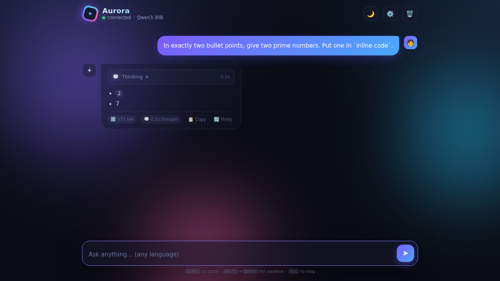

# ✦ Aurora — a cool, self‑contained AI chat (multi‑provider)

A single beautiful HTML file that streams answers from **your choice of free AI
providers** — with live markdown, a collapsible **"thinking"** panel, token stats,
themes, personalities, conversation memory, and optional **RAG grounding** with
citations. **Pure static file**: open it locally or drop it on GitHub Pages.
No server, no build, no dependencies.

## Use it

1. Open `index.html` (double‑click, or host it anywhere static —
   `aurora-chat.html` is the same file under its project name).
2. **⚙️ Settings** → pick a **provider** → paste **your own key** → pick a model → Save.
3. Chat.

Your keys are stored **only in this browser** (localStorage) and sent straight to
the provider you picked — never hardcoded, never to any other server. Safe to host
publicly: each visitor uses their own keys.

## Providers

| Provider | Key | Notes |
|---|---|---|
| 🌐 **OpenRouter** (default) | `sk-or-…` from [openrouter.ai/keys](https://openrouter.ai/keys) | `openrouter/free` auto‑routes to an available free model — most reliable |
| ☁️ **Cloudflare Workers AI** | none in browser — via your proxy Worker | Kimi, Qwen3‑30B, Llama 4 Scout, Gemma 4 26B, Nemotron 120B… daily free tier |
| ✨ **Google Gemini** | `AIza…` from [aistudio.google.com](https://aistudio.google.com) | 2.5 Flash / Flash‑Lite / Pro; generous free tier; direct browser calls |
| 🔌 **Custom OpenAI‑compatible** | optional Bearer | point Aurora at any `/chat/completions` — e.g. a local llama.cpp or a Factorium/Una endpoint |

### Cloudflare setup (one‑time, ~2 min, free)

Cloudflare's AI APIs don't allow direct browser calls (no CORS), so Aurora ships
[`cf-proxy-worker.js`](cf-proxy-worker.js) — a ~60‑line Worker you deploy on your
own Cloudflare account. It adds CORS and keeps your CF token **server‑side**.
Deploy it (instructions in the file header), then in Settings set Endpoint to
`https://<your-worker>.workers.dev/chat`.

## 📚 Knowledge search (RAG)

Toggle **"Ground answers in AI Search results"** and set the RAG URL to your
Worker's `/search` route. Aurora then retrieves relevant chunks from a
**Cloudflare AI Search** index (e.g. the [aisvet.sk](https://aisvet.sk) magazine),
grounds the answer in them, and shows **cited sources** under the reply.
Retrieval is Cloudflare's; generation stays with whichever provider you picked —
best of both, no generative quota burned on the search side.

## Features

| Feature | Detail |
|---|---|
| 🔀 Providers | OpenRouter · Cloudflare · Gemini · any OpenAI‑compatible |
| 🌊 Live streaming | SSE parsed token‑by‑token with a typing cursor (OpenAI + Gemini shapes) |
| 💭 Thinking panel | streams `reasoning` / `reasoning_content` / Gemini thoughts |
| 📚 RAG + citations | optional AI Search grounding with linked sources |
| ✍️ Markdown | headings, lists, **bold**, `code`, fenced blocks w/ copy — XSS‑escaped |
| 🔢 Token stats | per‑message tokens |
| 🧠 Memory | full conversation, persisted in localStorage |
| 🎭 Personalities | presets or your own system prompt |
| 🌗 Themes | animated aurora background, dark/light |
| ⏹️🔄📋 | stop mid‑stream, regenerate, copy |
| ⌨️ Shortcuts | Enter send · Shift+Enter newline · Esc stop |

> Free models are shared and can rate‑limit (429) or vanish (404). Aurora shows a
> friendly hint; `openrouter/free` sidesteps it by auto‑routing. Thinking models
> (Kimi, Qwen3) spend tokens on reasoning first — Aurora budgets for that.

## Roadmap

- 🗣️ Voice: TTS + speech input via the providers' free tiers
- 🖼️ Image generation (Gemini free tier)
- 🔐 Optional login gate for hosted deployments

## `_archive/`

Obsolete Cloudflare‑era proxy files and early builds live in `_archive/` — kept
for reference only; nothing in there is needed to run Aurora.

## Verified

- OpenRouter request + SSE parser tested against `openrouter/free` (streaming,
  reasoning captured, markdown answer). ✅
- Custom provider tested live against a local Factorium/Una OpenAI endpoint —
  full round trip in a real headless browser. ✅
- Cloudflare models smoke‑tested server‑side (Kimi k2.6/k2.7‑code, Qwen3‑30B,
  Llama 4 Scout, Gemma 4 26B, Nemotron 120B all answering). ✅
- Gemini CORS + API verified; browser path implemented per docs (BYOK). ✅
